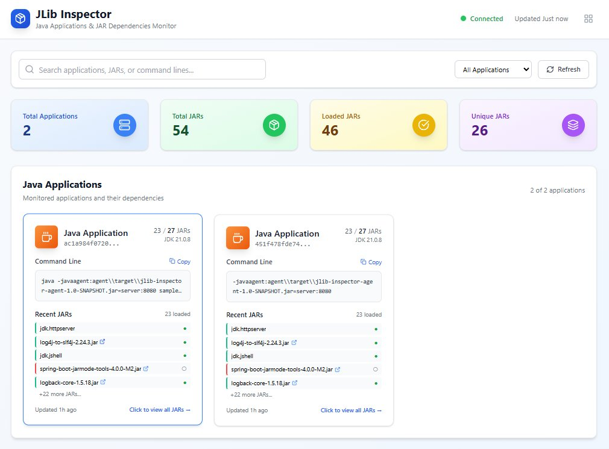

# JLib Inspector

<!-- BADGES -->
[](https://github.com/brunoborges/jlib-inspector/actions/workflows/ci.yml)
[](https://github.com/brunoborges/jlib-inspector/actions/workflows/security.yml)
[](https://opensource.org/licenses/MIT)
[](https://openjdk.java.net/)
[](https://nodejs.org/)
<!-- /BADGES -->

A comprehensive Java application monitoring dashboard that tracks JAR dependencies loaded during application runtime. The system consists of a Java agent, a standalone data collection server, and a modern React-based web dashboard to exemplify data visualization.

## 🎯 Why JLib Inspector?

When security vulnerabilities like **Log4Shell** strike, organizations face a critical challenge: **identifying which production systems are affected**. During the Log4j vulnerability crisis, many teams struggled with fundamental questions:

- *"Which of our production applications use Log4j?"*
- *"What version are they running?"*
- *"Are there transitive dependencies we don't know about?"*
- *"How can we quickly assess our exposure across hundreds of services?"*

**The Traditional Approach is Reactive and Error-Prone:**
- 🔍 Manual inspection of deployment artifacts
- 📂 Digging through production file systems
- 📋 Relying on outdated documentation or build scripts
- ⏰ Time-consuming emergency audits during critical security incidents
- 🎯 Missing transitive dependencies hidden deep in the dependency tree

**JLib Inspector Enables Proactive Dependency Visibility:**
- 🚀 **Real-time monitoring** of actual JAR files loaded by running JVMs
- 🎯 **Complete visibility** including transitive dependencies
- 📊 **Centralized dashboard** showing all applications and their dependencies
- 🔄 **Continuous tracking** of what's actually running vs. what's deployed
- ⚡ **Instant response** capability when new vulnerabilities are disclosed
- 🛡️ **Proactive security posture** instead of reactive emergency responses

**Production Reality Check:**
Unlike static analysis of build files, JLib Inspector shows you **exactly what JARs are loaded at runtime** - capturing the full picture including:
- JARs loaded dynamically through plugins or extensions
- Nested JARs within fat/uber JARs  
- Platform-specific dependencies loaded conditionally
- The actual classpath used by the running JVM

When the next security vulnerability emerges, you'll have immediate answers instead of emergency archaeology. 

## 🏗️ Architecture

- **Java Agent**: Instruments Java applications to track JAR loading and usage (shaded agent JAR)
- **JLib Server**: Standalone server that collects and aggregates data from instrumented applications (Port 8080, shaded server JAR)
- **Web Dashboard**: React-based frontend with real-time updates (Ports 3000 for http and 3001 for websocket)

## 📋 Prerequisites

- **Java 21+** (JDK with module system support)
- **Maven 3.9.11+** 
- **Node.js 14+** and **npm**
- **PowerShell** (for Windows) or equivalent shell

## 🚀 Quick Start

### 1. Build the Project

```powershell
# Clone and navigate to the project
cd jlib-inspector

# Build all components (agent + sample app)
mvn clean package
```

### 2. Start the JLib Server

The JLib Server collects data from instrumented Java applications:

```powershell
# Start the data collection server on port 8080 (shaded jar)
java -jar server/target/jlib-inspector-server-1.0-SNAPSHOT.jar 8080
```

**Expected Output:**
```
JLib HTTP Server started on port 8080
Available endpoints:
  PUT /api/apps/{appId} - Register/update application
  GET /api/apps - List all applications
  GET /api/apps/{appId} - Get application details
  GET /api/apps/{appId}/jars - List application JARs
  GET /health - Health check
```

### 3. Start the Web Dashboard

The unified Express.js server serves the React frontend:

```powershell
# Navigate to frontend directory
cd frontend

# Install dependencies (first time only)
npm install

# Build and start the unified server on port 3000
npm start
```

**Expected Output:**
```
> jlib-inspector-dashboard@2.0.0 start
> npm run build && node app.js

webpack 5.101.3 compiled successfully
Setting up data fetching schedule...
JLib Dashboard running on http://localhost:3000
WebSocket server running on port 3001
Connecting to JLib Server at http://localhost:8080
```

### 4. Run Java Applications with Monitoring

Instrument any Java application with the JLib Inspector agent:

**For your own applications:**
```powershell
java "-javaagent:path/to/jlib-inspector-agent-1.0-SNAPSHOT-shaded.jar=server:8080" -jar your-application.jar
```

You can test with the sample Spring application contained in this project:


```powershell
# Run the sample Spring Boot application with monitoring
java "-javaagent:agent/target/jlib-inspector-agent-1.0-SNAPSHOT-shaded.jar=server:8080" -jar sample-spring-app/target/sample-spring-app-1.0-SNAPSHOT.jar
```

## 🐳 Running with Docker

For containerized deployment, JLib Inspector provides Docker images and Docker Compose orchestration. This approach simplifies deployment and ensures consistent environments across development, testing, and production.

**Quick Docker Start:**
```bash
# Start all services with Docker Compose (runs from repo root)
./docker/start-docker.sh
```

The Docker setup includes:
- **Backend container** (JLib Server on port 8080)
- **Frontend container** (Dashboard on port 3000)  
- **Automatic networking** between containers
- **Volume mounts** for persistent data

📁 **For detailed Docker setup instructions, configuration options, and troubleshooting, see the [docker/README.md](docker/README.md) file.**

## 🌐 Access the Dashboard

Open your browser and navigate to: **http://localhost:3000**

### Screenshot



### Dashboard Features

- **📊 Real-time Application Monitoring**: Live view of all instrumented Java applications
- **🔍 JAR Dependency Analysis**: Complete view of loaded and available JARs
- **📋 Command Line Display**: Full command used to start each application
- **🔗 MvnRepository Integration**: Direct links to search Maven repositories
- **📋 Copy Functionality**: One-click copy for checksums and application IDs
- **🏷️ Tabbed JAR View**: Organized view of All/Loaded/Not Loaded JARs
- **🔍 Search & Filter**: Find applications and JARs quickly
- **📱 Responsive Design**: Works on desktop and mobile

## 📡 API Endpoints

### JLib Server (Port 8080)
- `GET /health` - Server health check
- `GET /api/apps` - List all monitored applications
- `GET /api/apps/{appId}` - Get specific application details
- `GET /api/apps/{appId}/jars` - Get JAR dependencies for an application
- `PUT /api/apps/{appId}` - Register/update application data

### Dashboard API (Port 3000)
- `GET /api/dashboard` - Combined dashboard data
- `GET /api/health` - Dashboard health status

## 🔧 Configuration

### Agent Configuration
The agent accepts the following parameters:

```powershell
# Local mode only (no server reporting)
-javaagent:jlib-inspector-agent.jar

# Report to local server
-javaagent:jlib-inspector-agent.jar=server:8080

# Report to remote server
-javaagent:jlib-inspector-agent.jar=server:remote-host:9000
```

### Environment Variables
```powershell
# JLib Server URL (default: http://localhost:8080)
$env:JLIB_SERVER_URL = "http://localhost:8080"

# Dashboard port (default: 3000)
$env:PORT = "3000"

# WebSocket port (default: 3001)
$env:WS_PORT = "3001"
```

## 🛠️ Available Scripts

### Frontend Commands
```powershell
cd frontend

# Build React app only
npm run build:only

# Start development and production server
npm start
```

### Backend Commands
```powershell
# Build all Java components
mvn clean verify
```

## 🐛 Troubleshooting

### Common Issues

**Dashboard shows "No applications":**
- Ensure JLib Server is running on port 8080
- Verify Java applications are started with the `-javaagent` parameter
- Check that applications are connecting to the correct server

**Build failures:**
- Ensure Java 21+ is installed and `JAVA_HOME` is set
- Clear Maven cache: `mvn clean`
- Check for port conflicts (8080, 3000, 3001)

**WebSocket connection issues:**
- Verify no firewall blocking ports 3000-3001
- Check browser console for connection errors
- Restart the dashboard server

### Logs and Debugging

**Enable verbose agent logging:**
```powershell
java -Djava.util.logging.config.file=logging.properties -javaagent:agent/target/jlib-inspector-agent-1.0-SNAPSHOT.jar=server:8080 -jar your-app.jar
```

**Check server logs:**
```powershell
# JLib Server logs appear in console
# Dashboard logs appear in console with timestamp
```

## 🏃‍♂️ Demo Scripts

For a quick demonstration, run the comprehensive testing script:

**Windows (PowerShell):**
```powershell
# Comprehensive test of all agent modes and server integration
.\demo-jlib-inspector.ps1
```

**Linux/macOS (Bash):**
```bash
# Comprehensive test of all agent modes and server integration
./demo-jlib-inspector.sh
```

These scripts will:
1. Build the project automatically
2. Test local-only mode (no server arguments)
3. Test server mode with graceful fallback
4. Test full server integration when server is available
5. Test custom host:port argument formats
6. Display comprehensive results and usage examples

**Prerequisites for bash script:**
- `curl` (for server health checks)
- `java` and `mvn` (automatically checked)

For manual testing, use:

```powershell
# Build the project
mvn verify

# Terminal 1: Start JLib Server (shaded jar)
java -jar server/target/jlib-inspector-server-1.0-SNAPSHOT.jar 8080

# Terminal 2: Start Dashboard
cd frontend && npm start

# Terminal 3: Run sample application with shaded agent
java -javaagent:agent/target/jlib-inspector-agent-1.0-SNAPSHOT-shaded.jar=server:8080 -jar sample-spring-app/target/sample-spring-app-1.0-SNAPSHOT.jar

# Open browser to http://localhost:3000
```

## 📁 Project Structure

```
jlib-inspector/
├── agent/                # Java Agent module (produces shaded agent JAR)
├── common/               # Shared code used by agent and server
├── server/               # Standalone JLib Server module (produces shaded server JAR)
├── sample-spring-app/    # Sample Spring Boot application
├── frontend/             # React dashboard (Express-based)
├── docker/               # Dockerfiles, compose, helper script
├── README.md             # Project overview (this file)
└── DOCKER.md             # Docker-specific docs
```

## 🎯 Key Features

### For Developers
- **Real-time JAR tracking** - See which dependencies are actually used
- **Performance insights** - Identify unused JARs for optimization
- **Dependency analysis** - Complete visibility into application dependencies
- **Command line monitoring** - Full startup command with arguments

### For Operations
- **Live monitoring** - Real-time view of all Java applications
- **Health checking** - Monitor application and server status
- **Resource tracking** - JAR file sizes and checksums
- **Historical data** - First seen and last updated timestamps

## 🤝 Contributing

1. Build the project: `mvn verify`
2. Run tests: `mvn test`
3. Start development environment following the Quick Start guide
4. Make changes and test with sample applications

## 📄 License

MIT License - see LICENSE file for details.
