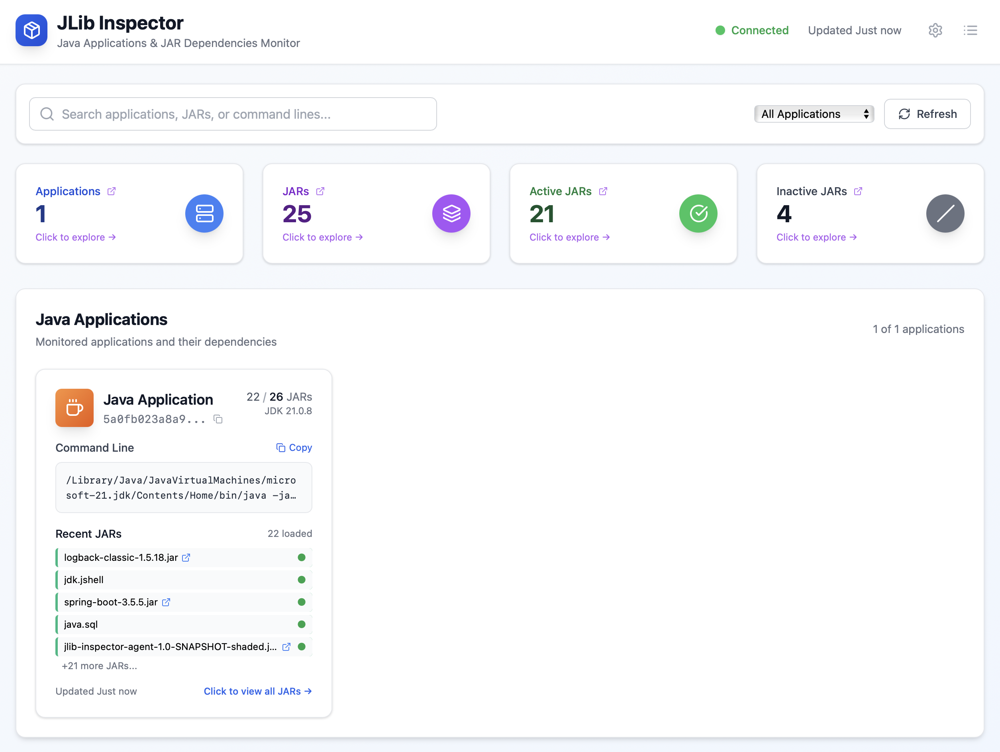
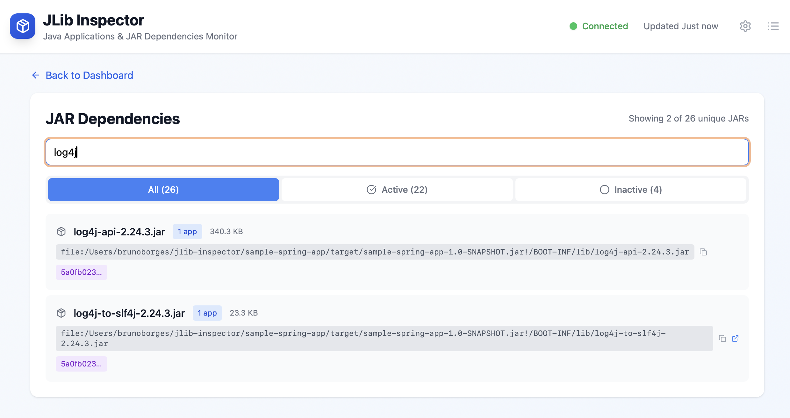
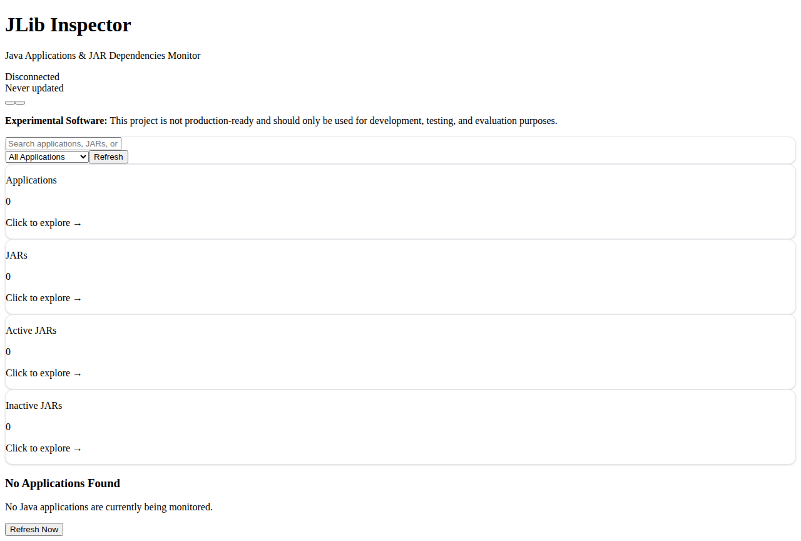

# Screenshots

Visual overview of the JLib Inspector dashboard and capabilities.

## 🖥️ Web Dashboard

### Main Dashboard View

The JLib Inspector dashboard provides a comprehensive view of all monitored Java applications and their dependencies.



**Features shown:**
- Real-time application monitoring
- JAR dependency tracking
- Application status indicators
- Command line information
- First seen and last updated timestamps

### Application Details View

Detailed view of individual applications showing specific JAR files and their loading status.



**Features shown:**
- Individual application focus
- JAR file listing with metadata
- Load status indicators (loaded vs. declared)
- File sizes and checksums
- Dependency hierarchy

### Experimental Warning

The dashboard clearly indicates the experimental nature of the project with appropriate warnings.



**Features shown:**
- Clear experimental status warning
- User guidance for appropriate usage
- Development and testing context

## 🎯 Key Dashboard Features

### Application Monitoring
- **Real-time Updates**: Live data through WebSocket connections
- **Application Status**: Health indicators and last-seen timestamps
- **Command Line Tracking**: Full startup commands with arguments
- **Unique Identification**: Automatic application fingerprinting

### Dependency Analysis
- **JAR Inventory**: Complete list of declared and loaded JARs
- **Load Status**: Visual indicators for actually-used vs. declared dependencies
- **File Metadata**: Sizes, checksums, and file paths
- **Nested JAR Support**: Tracks JARs within uber/fat JARs

### Security Insights
- **Vulnerability Assessment**: Quick identification of specific libraries
- **Version Tracking**: Exact version information for security analysis
- **Transitive Dependencies**: Complete dependency tree visibility
- **Runtime Reality**: What's actually loaded vs. what's declared

### Performance Optimization
- **Unused Dependencies**: Identify JARs that are declared but never loaded
- **Size Analysis**: File size information for optimization decisions
- **Load Patterns**: Understanding which dependencies are critical

## 🔍 Using the Dashboard

### Getting Started

1. **Start the JLib Server**:
   ```bash
   java -jar server/target/jlib-inspector-server-1.0-SNAPSHOT-shaded.jar 8080
   ```

2. **Start the Dashboard**:
   ```bash
   cd frontend && npm start
   ```

3. **Access the Dashboard**:
   Open [http://localhost:3000](http://localhost:3000) in your browser

4. **Monitor Applications**:
   Run Java applications with the agent:
   ```bash
   java -javaagent:agent/target/jlib-inspector-agent-1.0-SNAPSHOT-shaded.jar=server:8080 -jar your-app.jar
   ```

### Navigation

- **Home Page**: Overview of all monitored applications
- **Application Details**: Click on any application for detailed view
- **Real-time Updates**: Data refreshes automatically via WebSocket
- **Search and Filter**: Find specific applications or dependencies

### Data Interpretation

#### Application Cards
- **Green Status**: Application is running and reporting
- **Yellow Status**: Application hasn't reported recently
- **Red Status**: Application appears to be down

#### JAR Status Indicators
- **✅ Loaded**: JAR was actually used by the application
- **❌ Declared**: JAR was on classpath but never loaded
- **📦 Nested**: JAR found within another JAR file

#### Timestamps
- **First Seen**: When the application was first detected
- **Last Seen**: Most recent update from the application
- **Last Accessed**: When individual JARs were last accessed

## 🛠️ Technical Details

### Dashboard Technology Stack
- **Frontend**: React with modern JavaScript (ES6+)
- **Build Tool**: Webpack for bundling and optimization
- **Server**: Express.js for serving and API proxying
- **Real-time**: WebSocket for live updates
- **Styling**: CSS with responsive design

### Data Flow
1. **Java Agent** → Collects JAR data from applications
2. **JLib Server** → Aggregates data via REST API
3. **Express Server** → Proxies data to frontend
4. **WebSocket** → Pushes real-time updates
5. **React Frontend** → Renders interactive dashboard

### Browser Requirements
- **Modern Browsers**: Chrome 80+, Firefox 75+, Safari 13+, Edge 80+
- **JavaScript**: Must be enabled
- **WebSocket Support**: Required for real-time updates
- **Local Storage**: Used for user preferences

## 📊 Dashboard Configuration

### Environment Variables

Configure the dashboard behavior:

```bash
# Backend server URL
export JLIB_SERVER_URL="http://localhost:8080"

# Dashboard port
export PORT="3000"

# WebSocket port  
export WS_PORT="3001"
```

### Development Mode

For development with hot reload:

```bash
cd frontend
npm run dev
```

### Production Build

For optimized production deployment:

```bash
cd frontend
npm run build
npm start
```

## 🎨 Customization

### Theme and Styling

The dashboard uses CSS custom properties for easy theming:

```css
:root {
  --primary-color: #007acc;
  --secondary-color: #f8f9fa;
  --success-color: #28a745;
  --warning-color: #ffc107;
  --danger-color: #dc3545;
}
```

### Adding Custom Views

Extend the dashboard with custom components:

1. Add new React components in `frontend/src/components/`
2. Create new routes in `frontend/src/App.js`
3. Add navigation links as needed
4. Rebuild with `npm run build`

## 📱 Mobile Support

The dashboard includes responsive design for mobile devices:

- **Responsive Layout**: Adapts to screen sizes
- **Touch-Friendly**: Appropriate button and link sizes
- **Mobile Navigation**: Collapsible menu for small screens
- **Swipe Gestures**: Natural mobile interactions

## 🔗 Integration Options

### Embedding in Other Dashboards

The JLib Inspector dashboard can be embedded:

```html
<!-- Iframe embedding -->
<iframe src="http://localhost:3000" width="100%" height="600px"></iframe>
```

### API Integration

Use the REST API directly for custom integrations:

```javascript
// Fetch application data
fetch('http://localhost:8080/api/apps')
  .then(response => response.json())
  .then(apps => {
    // Custom processing
  });
```

### Exporting Data

Export dependency data for external tools:

```bash
# Export all application data
curl http://localhost:8080/api/apps > applications.json

# Export aggregated JAR report
curl http://localhost:8080/report > jar-report.json
```

## 🔗 Related Documentation

- [Getting Started](getting-started.html) - Setup and build instructions
- [Agent Documentation](agent.html) - Configure applications for monitoring
- [Server Documentation](server.html) - Backend API and configuration
- [Javadoc](javadoc/index.html) - Complete API reference